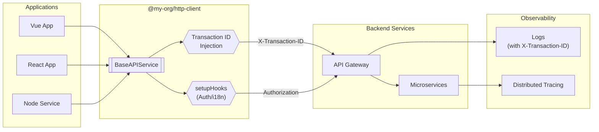

# @my-org/http-client

Framework-agnostic HTTP client with automatic transaction tracing and dependency injection.

- ทุก App ใช้ `@my-org/http-client` → ส่ง Request พร้อม Transaction ID อัตโนมัติ
- รองรับ Dependency Injection สำหรับ Auth, i18n, Error Handling
- ใช้ได้กับทุก Framework: Vue, React, Angular, Node.js



## Features

| Feature | Description |
|---------|-------------|
| **Transaction Tracing** | Auto-inject `X-Transaction-ID` header for distributed tracing |
| **Flexible Generics** | `Promise<T>` without enforced response shape |
| **Dependency Injection** | Inject Auth, i18n, Error handlers via `setupHooks` |
| **Framework Agnostic** | Works with Vue, React, Angular, Node.js |
| **TypeScript First** | Full type safety with excellent IDE support |

---

## ติดตั้ง

```bash
npm install @my-org/http-client axios
```

> **Note**: `axios` เป็น peer dependency เพื่อป้องกัน version conflicts

---

## เริ่มต้นใช้งาน

### Basic Usage

```typescript
import { BaseAPIService } from '@my-org/http-client';

const api = new BaseAPIService({
  axiosConfig: {
    baseURL: 'https://api.example.com',
    timeout: 30000,
  },
});

// GET request
const users = await api.get<User[]>('/users');

// POST request
const newUser = await api.post<User>('/users', { name: 'John' });

// PUT request
await api.put<User>('/users/1', { name: 'John Updated' });

// DELETE request
await api.delete('/users/1');
```

---

## การใช้งานกับ Vue + Pinia

### services/api.ts

```typescript
import { BaseAPIService } from '@my-org/http-client';
import { useAuthStore } from '@/stores/auth';
import router from '@/router';

export const api = new BaseAPIService({
  axiosConfig: {
    baseURL: import.meta.env.VITE_API_URL,
    timeout: 30000,
  },
  setupHooks: (instance) => {
    // Request Interceptor: Inject Auth Token
    instance.interceptors.request.use((config) => {
      const authStore = useAuthStore();
      if (authStore.token) {
        config.headers.Authorization = `Bearer ${authStore.token}`;
      }
      return config;
    });

    // Response Interceptor: Handle 401
    instance.interceptors.response.use(
      (response) => response,
      async (error) => {
        if (error.response?.status === 401) {
          const authStore = useAuthStore();
          authStore.logout();
          router.push('/login');
        }
        return Promise.reject(error);
      }
    );
  },
});
```

### composables/useUsers.ts

```typescript
import { ref } from 'vue';
import { api } from '@/services/api';

interface User {
  id: number;
  name: string;
  email: string;
}

export function useUsers() {
  const users = ref<User[]>([]);
  const loading = ref(false);

  async function fetchUsers() {
    loading.value = true;
    try {
      users.value = await api.get<User[]>('/users');
    } finally {
      loading.value = false;
    }
  }

  return { users, loading, fetchUsers };
}
```

---

## การใช้งานกับ React + Zustand

### services/api.ts

```typescript
import { BaseAPIService } from '@my-org/http-client';
import { useAuthStore } from '@/stores/auth';

export const api = new BaseAPIService({
  axiosConfig: {
    baseURL: process.env.REACT_APP_API_URL,
    timeout: 30000,
  },
  setupHooks: (instance) => {
    instance.interceptors.request.use((config) => {
      const token = useAuthStore.getState().token;
      if (token) {
        config.headers.Authorization = `Bearer ${token}`;
      }
      return config;
    });
  },
});
```

### hooks/useUsers.ts (with React Query)

```typescript
import { useQuery, useMutation } from '@tanstack/react-query';
import { api } from '@/services/api';

interface User {
  id: number;
  name: string;
}

export function useUsers() {
  return useQuery({
    queryKey: ['users'],
    queryFn: () => api.get<User[]>('/users'),
  });
}

export function useCreateUser() {
  return useMutation({
    mutationFn: (data: Omit<User, 'id'>) => api.post<User>('/users', data),
  });
}
```

---

## Service Class Pattern

### services/product.service.ts

```typescript
import { api } from './api';

// Types
interface Product {
  id: string;
  name: string;
  price: number;
}

interface ResponseMap<T> {
  success: boolean;
  data: T | null;
  error: string | null;
}

// Helper functions
function mapResponse<T>(data: T): ResponseMap<T> {
  return { success: true, data, error: null };
}

function mapError<T>(error: unknown): ResponseMap<T> {
  const message = error instanceof Error ? error.message : 'Unknown error';
  return { success: false, data: null, error: message };
}

// Service class
class ProductService {
  async getProducts(): Promise<ResponseMap<Product[]>> {
    try {
      const data = await api.get<Product[]>('/products');
      return mapResponse(data);
    } catch (error) {
      return mapError(error);
    }
  }

  async createProduct(body: Omit<Product, 'id'>): Promise<ResponseMap<Product>> {
    try {
      const data = await api.post<Product>('/products', body);
      return mapResponse(data);
    } catch (error) {
      return mapError(error);
    }
  }
}

export const productService = new ProductService();
```

### Usage

```typescript
const result = await productService.getProducts();

if (result.success) {
  console.log('Products:', result.data);
} else {
  console.error('Error:', result.error);
}
```

---

## File Upload

```typescript
async function uploadAvatar(userId: number, file: File) {
  const formData = new FormData();
  formData.append('avatar', file);

  return api.postUploadFile<{ url: string }>(`/users/${userId}/avatar`, formData, {
    onUploadProgress: (event) => {
      const percent = Math.round((event.loaded * 100) / (event.total ?? 1));
      console.log(`Upload: ${percent}%`);
    },
  });
}
```

---

## Request Cancellation

```typescript
const controller = api.createAbortController();

// Start request
const promise = api.get('/slow-endpoint', { signal: controller.signal });

// Cancel request
controller.abort();
```

---

## Configuration Options

```typescript
interface BaseAPIServiceConfig {
  axiosConfig: AxiosRequestConfig;      // Axios config (baseURL, timeout, etc.)
  setupHooks?: InterceptorSetup;        // Inject your interceptors
  transactionIdHeader?: string;         // Default: 'X-Transaction-ID'
  disableTransactionId?: boolean;       // Disable auto-injection
}
```

---

## API Reference

| Method | Signature | Description |
|--------|-----------|-------------|
| `get` | `get<T>(url, options?): Promise<T>` | GET request |
| `post` | `post<T, D>(url, data?, options?): Promise<T>` | POST request |
| `put` | `put<T, D>(url, data?, options?): Promise<T>` | PUT request |
| `patch` | `patch<T, D>(url, data?, options?): Promise<T>` | PATCH request |
| `delete` | `delete<T, D>(url, data?, options?): Promise<T>` | DELETE request |
| `postUploadFile` | `postUploadFile<T>(url, data?, options?): Promise<T>` | File upload |
| `createAbortController` | `createAbortController(): AbortController` | For cancellation |
| `isAxiosError` | `isAxiosError(error): boolean` | Type guard |

### Request Options

```typescript
interface RequestOptions {
  params?: Record<string, any>;     // Query parameters
  headers?: Record<string, string>; // Additional headers
  timeout?: number;                 // Override timeout
  signal?: AbortSignal;             // For cancellation
}
```

---

## Error Handling

```typescript
try {
  await api.get('/endpoint');
} catch (error) {
  if (api.isAxiosError(error)) {
    console.log('Status:', error.response?.status);
    console.log('Message:', error.response?.data?.message);
  }
}
```

---

## Scripts

```bash
npm run build           # Build library
npm run dev             # Watch mode
npm test                # Run tests
npm run test:coverage   # With coverage
npm run typecheck       # Type check
```

---

## License

MIT
