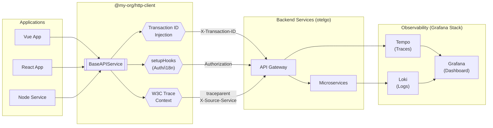

# @my-org/http-client

Framework-agnostic HTTP client with automatic transaction tracing and OpenTelemetry support.

- ทุก App ใช้ `@my-org/http-client` → ส่ง Request พร้อม Transaction ID อัตโนมัติ
- รองรับ Dependency Injection สำหรับ Auth, i18n, Error Handling
- ใช้ได้กับทุก Framework: Vue, React, Angular, Node.js
- รองรับ OpenTelemetry (W3C Trace Context) สำหรับ Distributed Tracing



## Features

| Feature | Description |
|---------|-------------|
| **Transaction Tracing** | Auto-inject `X-Transaction-ID` header for distributed tracing |
| **OpenTelemetry Support** | W3C Trace Context (`traceparent`) for otelgo integration |
| **Service Identification** | `X-Source-Service` header for frontend visibility in Tempo |
| **Flexible Generics** | `Promise<T>` without enforced response shape |
| **Dependency Injection** | Inject Auth, i18n, Error handlers via `setupHooks` |
| **Framework Agnostic** | Works with Vue, React, Angular, Node.js |
| **TypeScript First** | Full type safety with excellent IDE support |
| **OTel-Ready** | Auto-detects `@opentelemetry/api` if installed |

---

## ติดตั้ง

### Via Git (Recommended for internal use)

```bash
npm install github:Most-Fullstack/http-client axios uuid
```

Or with specific version tag:

```json
{
  "dependencies": {
    "@my-org/http-client": "github:Most-Fullstack/http-client#v1.0.0",
    "axios": "^1.6.0",
    "uuid": "^9.0.0"
  }
}
```

### Via NPM (if published)

```bash
npm install @my-org/http-client axios uuid
```

> **Note**: `axios` and `uuid` are peer dependencies

---

## เริ่มต้นใช้งาน

### Basic Usage

```typescript
import { createHttpClient } from '@my-org/http-client';

const api = createHttpClient({
  axiosConfig: {
    baseURL: 'https://api.example.com',
    timeout: 30000,
  },
});

// GET request
const users = await api.get<User[]>('/users');

// POST request
const newUser = await api.post<User>('/users', { name: 'John' });

// PUT request
await api.put<User>('/users/1', { name: 'John Updated' });

// PATCH request
await api.patch<User>('/users/1', { name: 'John Patched' });

// DELETE request
await api.delete('/users/1');
```

### With OpenTelemetry (otelgo Backend)

```typescript
const api = createHttpClient({
  axiosConfig: {
    baseURL: '/api',
    timeout: 30000,
  },
  // Enable W3C Trace Context propagation
  enableTraceContext: true,
  // Use trace ID as transaction ID for log correlation
  useTraceIdAsTransactionId: true,
  // Service name shows in Tempo traces
  serviceName: 'MY-FRONTEND',
});
```

**Headers sent to backend:**
```
traceparent: 00-abc123...-def456...-01
X-Transaction-ID: abc123...
X-Source-Service: MY-FRONTEND
```

**Result in Grafana Tempo:**
```
MY-FRONTEND: HTTP GET /api/users    ← Frontend span (created by backend)
  └── BACKEND-API: /api/users       ← Backend span
      └── Database Query
```

---

## Configuration Options

```typescript
interface BaseAPIServiceConfig {
  /** Axios config (baseURL, timeout, headers, etc.) */
  axiosConfig: AxiosRequestConfig;
  
  /** Inject your interceptors (auth, i18n, error handling) */
  setupHooks?: InterceptorSetup;
  
  /** Custom header name (default: 'X-Transaction-ID') */
  transactionIdHeader?: string;
  
  /** Disable auto Transaction ID injection */
  disableTransactionId?: boolean;
  
  /** Enable W3C traceparent header for OpenTelemetry */
  enableTraceContext?: boolean;
  
  /** Use trace ID as Transaction ID for log correlation */
  useTraceIdAsTransactionId?: boolean;
  
  /** Frontend service name (shows in Tempo traces) */
  serviceName?: string;
}
```

---

## การใช้งานกับ Vue + Pinia

### services/api.ts

```typescript
import { createHttpClient } from '@my-org/http-client';
import { useAuthStore } from '@/stores/auth';
import router from '@/router';

export const api = createHttpClient({
  axiosConfig: {
    baseURL: import.meta.env.VITE_API_URL,
    timeout: 30000,
  },
  enableTraceContext: true,
  serviceName: 'MY-FRONTEND',
  setupHooks: (instance) => {
    // Request Interceptor: Inject Auth Token
    instance.interceptors.request.use((config) => {
      const authStore = useAuthStore();
      if (authStore.token) {
        config.headers.Authorization = `Bearer ${authStore.token}`;
      }
      return config;
    });

    // Response Interceptor: Handle 401
    instance.interceptors.response.use(
      (response) => response,
      async (error) => {
        if (error.response?.status === 401) {
          const authStore = useAuthStore();
          authStore.logout();
          router.push('/login');
        }
        return Promise.reject(error);
      }
    );
  },
});
```

### composables/useUsers.ts

```typescript
import { ref } from 'vue';
import { api } from '@/services/api';

interface User {
  id: number;
  name: string;
  email: string;
}

export function useUsers() {
  const users = ref<User[]>([]);
  const loading = ref(false);

  async function fetchUsers() {
    loading.value = true;
    try {
      users.value = await api.get<User[]>('/users');
    } finally {
      loading.value = false;
    }
  }

  return { users, loading, fetchUsers };
}
```

---

## การใช้งานกับ React + Zustand

### services/api.ts

```typescript
import { createHttpClient } from '@my-org/http-client';
import { useAuthStore } from '@/stores/auth';

export const api = createHttpClient({
  axiosConfig: {
    baseURL: process.env.REACT_APP_API_URL,
    timeout: 30000,
  },
  enableTraceContext: true,
  serviceName: 'REACT-FRONTEND',
  setupHooks: (instance) => {
    instance.interceptors.request.use((config) => {
      const token = useAuthStore.getState().token;
      if (token) {
        config.headers.Authorization = `Bearer ${token}`;
      }
      return config;
    });
  },
});
```

### hooks/useUsers.ts (with React Query)

```typescript
import { useQuery, useMutation } from '@tanstack/react-query';
import { api } from '@/services/api';

interface User {
  id: number;
  name: string;
}

export function useUsers() {
  return useQuery({
    queryKey: ['users'],
    queryFn: () => api.get<User[]>('/users'),
  });
}

export function useCreateUser() {
  return useMutation({
    mutationFn: (data: Omit<User, 'id'>) => api.post<User>('/users', data),
  });
}
```

---

## Service Class Pattern

### services/product.service.ts

```typescript
import { api } from './api';

// Types
interface Product {
  id: string;
  name: string;
  price: number;
}

interface ResponseMap<T> {
  success: boolean;
  data: T | null;
  error: string | null;
}

// Helper functions
function mapResponse<T>(data: T): ResponseMap<T> {
  return { success: true, data, error: null };
}

function mapError<T>(error: unknown): ResponseMap<T> {
  const message = error instanceof Error ? error.message : 'Unknown error';
  return { success: false, data: null, error: message };
}

// Service class
class ProductService {
  async getProducts(): Promise<ResponseMap<Product[]>> {
    try {
      const data = await api.get<Product[]>('/products');
      return mapResponse(data);
    } catch (error) {
      return mapError(error);
    }
  }

  async createProduct(body: Omit<Product, 'id'>): Promise<ResponseMap<Product>> {
    try {
      const data = await api.post<Product>('/products', body);
      return mapResponse(data);
    } catch (error) {
      return mapError(error);
    }
  }
}

export const productService = new ProductService();
```

### Usage

```typescript
const result = await productService.getProducts();

if (result.success) {
  console.log('Products:', result.data);
} else {
  console.error('Error:', result.error);
}
```

---

## File Upload

```typescript
async function uploadAvatar(userId: number, file: File) {
  const formData = new FormData();
  formData.append('avatar', file);

  return api.postUploadFile<{ url: string }>(`/users/${userId}/avatar`, formData, {
    onUploadProgress: (event) => {
      const percent = Math.round((event.loaded * 100) / (event.total ?? 1));
      console.log(`Upload: ${percent}%`);
    },
  });
}
```

---

## Request Cancellation

```typescript
const controller = api.createAbortController();

// Start request
const promise = api.get('/slow-endpoint', { signal: controller.signal });

// Cancel request
controller.abort();
```

---

## OpenTelemetry Integration

### How It Works

```
┌─────────────────────────────────────────────────────────────────────────┐
│                        Frontend (http-client)                           │
│  ┌─────────────────────────────────────────────────────────────────┐   │
│  │ 1. Generate traceparent: 00-{traceId}-{spanId}-01               │   │
│  │ 2. Set X-Transaction-ID: {traceId}                              │   │
│  │ 3. Set X-Source-Service: MY-FRONTEND                            │   │
│  └─────────────────────────────────────────────────────────────────┘   │
└──────────────────────────────────│──────────────────────────────────────┘
                                   │ HTTP Request
                                   ▼
┌─────────────────────────────────────────────────────────────────────────┐
│                        Backend (otelgo)                                 │
│  ┌─────────────────────────────────────────────────────────────────┐   │
│  │ 1. Extract traceparent header                                    │   │
│  │ 2. If X-Source-Service present:                                  │   │
│  │    - Create span for frontend (MY-FRONTEND)                      │   │
│  │    - Create backend span as child                                │   │
│  │ 3. Export both spans to Tempo                                    │   │
│  └─────────────────────────────────────────────────────────────────┘   │
└──────────────────────────────────│──────────────────────────────────────┘
                                   │ OTLP
                                   ▼
┌─────────────────────────────────────────────────────────────────────────┐
│                        Grafana Tempo                                    │
│  ┌─────────────────────────────────────────────────────────────────┐   │
│  │ MY-FRONTEND: HTTP GET /api/users                                 │   │
│  │   └── BACKEND-API: /api/users                                    │   │
│  │       └── Database Query                                         │   │
│  └─────────────────────────────────────────────────────────────────┘   │
└─────────────────────────────────────────────────────────────────────────┘
```

### Backend Middleware (Go + otelgo)

```go
// middleware/otel.go
func OTelMiddleware() gin.HandlerFunc {
    return func(c *gin.Context) {
        sourceService := c.GetHeader("X-Source-Service")
        transactionID := c.GetHeader("X-Transaction-ID")

        ctx := c.Request.Context()

        // If frontend header present, create span for it
        if sourceService != "" {
            frontendTracer := getFrontendTracer(sourceService)
            ctx, frontendSpan := frontendTracer.Start(ctx,
                "HTTP "+c.Request.Method+" "+c.Request.URL.Path,
                trace.WithSpanKind(trace.SpanKindClient),
            )
            defer frontendSpan.End()
        }

        // Create backend span
        ctx, span := eto.Trace().
            Name(c.FullPath()).
            FromContext(ctx).
            Kind(trace.SpanKindServer).
            Attr("transaction.id", transactionID).
            Start()
        defer span.End()

        c.Request = c.Request.WithContext(ctx)
        c.Next()
    }
}
```

### OTel-Ready (Auto-detect)

If your app has `@opentelemetry/api` installed, the library automatically uses the active span's trace ID:

```typescript
// App with full OTel SDK
import { trace, context } from '@opentelemetry/api';

const span = trace.getTracer('app').startSpan('user-action');
context.with(trace.setSpan(context.active(), span), async () => {
  // http-client uses the REAL trace ID from this span
  await api.get('/users');
});
```

---

## API Reference

| Method | Signature | Description |
|--------|-----------|-------------|
| `get` | `get<T>(url, options?): Promise<T>` | GET request |
| `post` | `post<T, D>(url, data?, options?): Promise<T>` | POST request |
| `put` | `put<T, D>(url, data?, options?): Promise<T>` | PUT request |
| `patch` | `patch<T, D>(url, data?, options?): Promise<T>` | PATCH request |
| `delete` | `delete<T, D>(url, data?, options?): Promise<T>` | DELETE request |
| `postUploadFile` | `postUploadFile<T>(url, data?, options?): Promise<T>` | File upload |
| `createAbortController` | `createAbortController(): AbortController` | For cancellation |
| `isAxiosError` | `isAxiosError(error): boolean` | Type guard |

### Request Options

```typescript
interface RequestOptions {
  params?: Record<string, any>;     // Query parameters
  headers?: Record<string, string>; // Additional headers
  timeout?: number;                 // Override timeout
  signal?: AbortSignal;             // For cancellation
}

interface UploadOptions extends RequestOptions {
  onUploadProgress?: (event: AxiosProgressEvent) => void;
}
```

---

## Error Handling

```typescript
try {
  await api.get('/endpoint');
} catch (error) {
  if (api.isAxiosError(error)) {
    console.log('Status:', error.response?.status);
    console.log('Message:', error.response?.data?.message);
  }
}
```

---

## Scripts

```bash
npm run build           # Build library
npm run dev             # Watch mode
npm test                # Run tests
npm run test:coverage   # With coverage
npm run typecheck       # Type check
```

---

## Version Management

### Creating a new version

```bash
# In http-client repo
git add -A
git commit -m "feat: your changes"
git tag v1.0.1
git push origin main --tags
```

### Updating in consumer apps

```json
// Update version in package.json
"@my-org/http-client": "github:Most-Fullstack/http-client#v1.0.1"
```

```bash
npm install
```

---

## License

MIT
