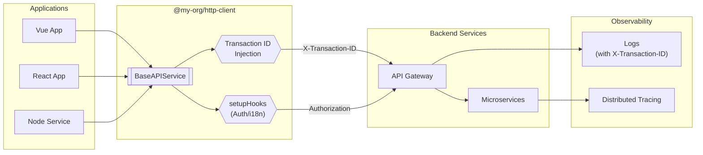

# @my-org/http-client

Framework-agnostic HTTP client with automatic transaction tracing and dependency injection.

- ทุก App ใช้ `@my-org/http-client` → ส่ง Request พร้อม Transaction ID อัตโนมัติ
- รองรับ Dependency Injection สำหรับ Auth, i18n, Error Handling
- ใช้ได้กับทุก Framework: Vue, React, Angular, Node.js
- รองรับ OpenTelemetry (W3C Trace Context) สำหรับ Distributed Tracing



## Features

| Feature | Description |
|---------|-------------|
| **Transaction Tracing** | Auto-inject `X-Transaction-ID` header for distributed tracing |
| **OpenTelemetry Support** | W3C Trace Context (`traceparent`) for otelgo integration |
| **Flexible Generics** | `Promise<T>` without enforced response shape |
| **Dependency Injection** | Inject Auth, i18n, Error handlers via `setupHooks` |
| **Framework Agnostic** | Works with Vue, React, Angular, Node.js |
| **TypeScript First** | Full type safety with excellent IDE support |

---

## ติดตั้ง

```bash
npm install @my-org/http-client axios
```

> **Note**: `axios` เป็น peer dependency เพื่อป้องกัน version conflicts

---

## เริ่มต้นใช้งาน

### Basic Usage

```typescript
import { createHttpClient } from '@my-org/http-client';

const api = createHttpClient({
  axiosConfig: {
    baseURL: 'https://api.example.com',
    timeout: 30000,
  },
});

// GET request
const users = await api.get<User[]>('/users');

// POST request
const newUser = await api.post<User>('/users', { name: 'John' });

// PUT request
await api.put<User>('/users/1', { name: 'John Updated' });

// DELETE request
await api.delete('/users/1');
```

### With OpenTelemetry (otelgo Backend)

```typescript
const api = createHttpClient({
  axiosConfig: {
    baseURL: '/api',
    timeout: 30000,
  },
  // Enable W3C Trace Context propagation
  enableTraceContext: true,
  // Use trace ID as transaction ID for log correlation
  useTraceIdAsTransactionId: true,
  // Service name shows in Tempo traces
  serviceName: 'INDO-FRONTEND',
});
```

---

## Configuration Options

```typescript
interface BaseAPIServiceConfig {
  axiosConfig: AxiosRequestConfig;      // Axios config (baseURL, timeout, etc.)
  setupHooks?: InterceptorSetup;        // Inject your interceptors
  transactionIdHeader?: string;         // Default: 'X-Transaction-ID'
  disableTransactionId?: boolean;       // Disable auto-injection
  enableTraceContext?: boolean;         // Enable W3C traceparent header
  useTraceIdAsTransactionId?: boolean;  // Use trace ID for logs correlation
  serviceName?: string;                 // Frontend name in traces
}
```

---

## การใช้งานกับ Vue + Pinia

```typescript
import { createHttpClient } from '@my-org/http-client';
import { useAuthStore } from '@/stores/auth';
import router from '@/router';

export const api = createHttpClient({
  axiosConfig: {
    baseURL: import.meta.env.VITE_API_URL,
    timeout: 30000,
  },
  enableTraceContext: true,
  serviceName: 'MY-FRONTEND',
  setupHooks: (instance) => {
    // Request Interceptor: Inject Auth Token
    instance.interceptors.request.use((config) => {
      const authStore = useAuthStore();
      if (authStore.token) {
        config.headers.Authorization = `Bearer ${authStore.token}`;
      }
      return config;
    });

    // Response Interceptor: Handle 401
    instance.interceptors.response.use(
      (response) => response,
      async (error) => {
        if (error.response?.status === 401) {
          const authStore = useAuthStore();
          authStore.logout();
          router.push('/login');
        }
        return Promise.reject(error);
      }
    );
  },
});
```

---

## API Reference

| Method | Signature | Description |
|--------|-----------|-------------|
| `get` | `get<T>(url, options?): Promise<T>` | GET request |
| `post` | `post<T, D>(url, data?, options?): Promise<T>` | POST request |
| `put` | `put<T, D>(url, data?, options?): Promise<T>` | PUT request |
| `patch` | `patch<T, D>(url, data?, options?): Promise<T>` | PATCH request |
| `delete` | `delete<T, D>(url, data?, options?): Promise<T>` | DELETE request |
| `postUploadFile` | `postUploadFile<T>(url, data?, options?): Promise<T>` | File upload |
| `createAbortController` | `createAbortController(): AbortController` | For cancellation |
| `isAxiosError` | `isAxiosError(error): boolean` | Type guard |

---

## Error Handling

```typescript
try {
  await api.get('/endpoint');
} catch (error) {
  if (api.isAxiosError(error)) {
    console.log('Status:', error.response?.status);
    console.log('Message:', error.response?.data?.message);
  }
}
```

---

## Scripts

```bash
npm run build           # Build library
npm run dev             # Watch mode
npm test                # Run tests
npm run test:coverage   # With coverage
npm run typecheck       # Type check
```

---

## License

MIT
